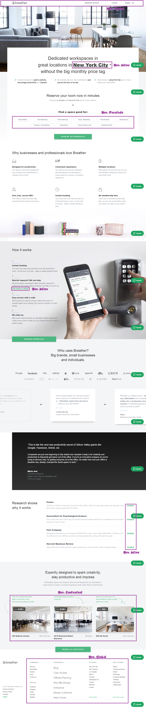
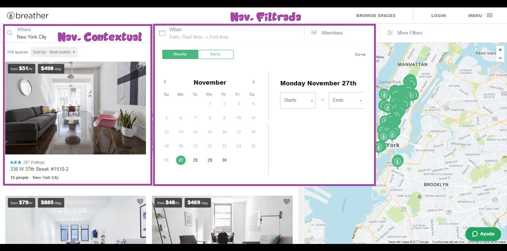
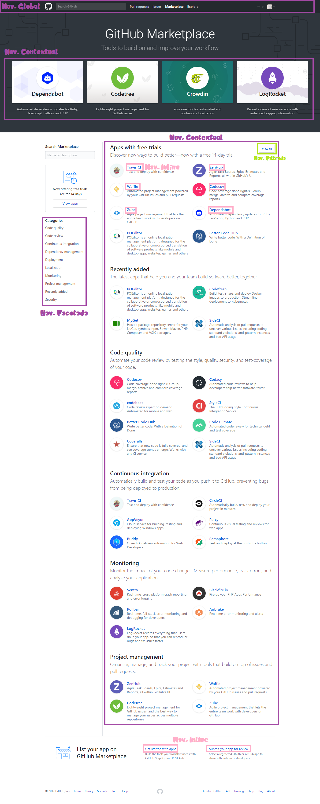
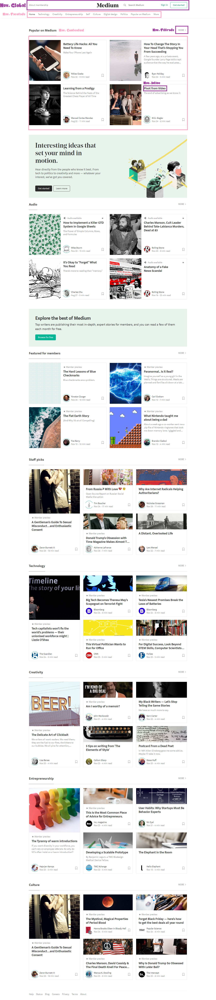

# **Challenge 2: Elementos de los Navegadores**

* **Track:** _Common Core_
* **Curso:** _Creando tu primer sitio web interactivo_
* **Unidad:** _Intro a User Experience Design_

***

## Objetivo

* El reto consiste en identifica los elementos de navegación en los siguientes sites

### [**Breather**](https://breather.com/)
  

### [**Github**](https://github.com/)
   

### [**Medium**](https://medium.com/)  

